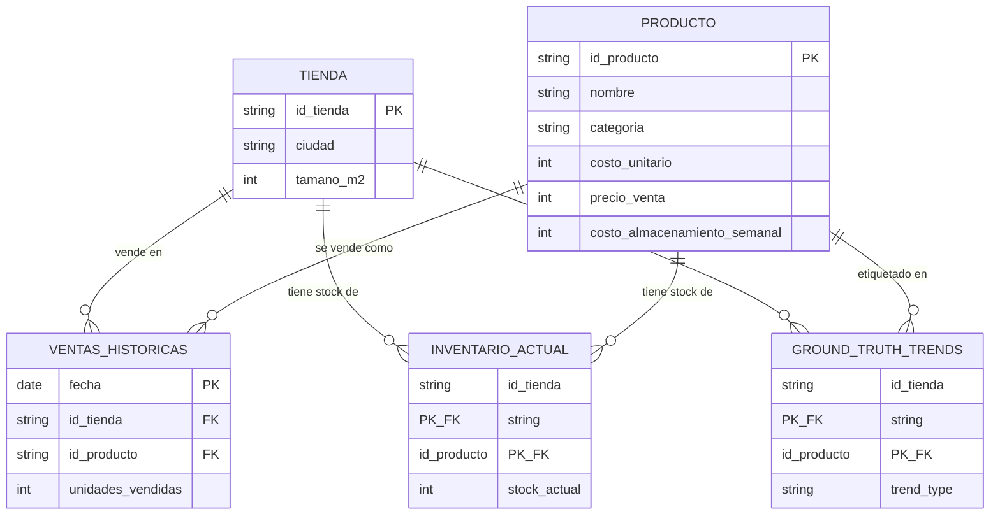

## Autor

*Nombre:* Edinson Vicente Aguilar Rodriguez
___
# Tostao — Case A: Optimización de abastecimiento

El proyecto parte de una necesidad concreta: anticipar cuánto se va a vender de cada SKU en cada tienda para tomar mejores decisiones de abastecimiento. Para esto, se construye un pronóstico de demanda semanal y, a partir de ese resultado, se determina una cantidad recomendada de pedido.

## 1. Objetivo de negocio

Anticipar la demanda de cada producto en cada tienda para la siguiente semana y definir cuánto pedir equilibrando quiebres de inventario y sobreinventario.

## 2. Datos

| Archivo | Uso |
|---|---|
| `ventas_historicas.csv` | Forecasting |
| `inventario_actual.csv` | Stock disponible para la recomendación final |
| `catalogo_productos.csv` | Costos, precio, margen y almacenamiento |
| `maestro_tiendas.csv` | Ciudad y tamaño de tienda |
| `ground_truth_trends.csv` | Diagnóstico; no entra como predictor |

La historia tiene 91 días, 20 tiendas, 8 productos y 160 series SKU–tienda.

### 2.1 Diagrama entidad-relación

Dos catálogos (Tienda, Producto) conectados por tres tablas asociativas de distinto grano: un histórico diario de ventas, una foto de inventario y una etiqueta de tendencia que **no** entra como predictor.



| Archivo | Tipo | Clave | Columnas propias |
|---|---|---|---|
| `maestro_tiendas.csv` | Catálogo | `id_tienda` | ciudad, tamaño_m2 |
| `catalogo_productos.csv` | Catálogo | `id_producto` | nombre, categoria, costo_unitario, precio_venta, costo_almacenamiento_semanal |
| `ventas_historicas.csv` | Asociativa | `fecha + id_tienda + id_producto` | unidades_vendidas |
| `inventario_actual.csv` | Asociativa | `id_tienda + id_producto` | stock_actual |
| `ground_truth_trends.csv` | Asociativa | `id_tienda + id_producto` | trend_type |

`ventas_historicas.csv` es la única tabla con dimensión temporal (14,560 filas = 160 series × 91 días); `inventario_actual.csv` es un único snapshot (160 filas) — por eso el backtest económico de la sección 7 es contrafactual, no una reconstrucción de la operación real.

## 3. Preparación y features

`src/data_preparation.py` valida las claves y construye datasets derivados desde `data/raw/`. Las features incluyen:

- lags 1/7/14/21/28;
- rolling mean 7/14/28;
- rolling std 7/14;
- tendencia reciente;
- día de semana, fin de semana y semana ISO;
- ciudad, tamaño de tienda y atributos económicos del producto.

Las ventanas históricas usan `shift(1)` para que la observación del día objetivo no entre en sus propias features.

El target semanal es:

$$Y_t = D_{t+1}+\dots+D_{t+7}$$

El último día observado es **31/03/2024**. Ese día se usa como **origen del forecast final** y no se descarta por no tener target futuro conocido. El forecast final representa **01/04/2024–07/04/2024**.

## 4. Forecasting y validación temporal

Se comparan tres estrategias mediante rolling-origin, siempre entrenando únicamente con targets que ya eran conocidos en cada fecha de origen:

- **Seasonal Naive:** suma de los siete días inmediatamente anteriores.
- **Strategy A — weekly direct:** un XGBoost predice directamente el total de los próximos 7 días.
- **Strategy B — 7 daily direct:** siete XGBoost, uno por horizonte diario, cuyas predicciones se agregan.

Resultados reproducibles de `python main.py`:

| Estrategia | RMSE | MAE | WAPE |
|---|---:|---:|---:|
| Seasonal Naive | 15.962 | 12.238 | 13.16% |
| Strategy A — weekly direct | 14.739 | 11.333 | 12.19% |
| **Strategy B — 7 daily direct** | **14.454** | **11.120** | **11.96%** |

**Champion: Strategy B.** Reduce el RMSE aproximadamente **9.4%** frente al baseline y el WAPE aproximadamente **9.1%**.

La selección se hace con resultados calculados por código; no se utilizan métricas hard-codeadas.

## 5. Incertidumbre

La incertidumbre del champion se estima con residuos **out-of-fold** del rolling backtest. El perfil se calcula por producto para capturar diferentes niveles de variabilidad.

Se reportan:

- `bias`: media del error `actual - forecast`;
- `sigma`: desviación estándar del error;
- intervalo central aproximado del 80%:

$$[\hat D+bias-1.2816\sigma,\;\hat D+bias+1.2816\sigma]$$

La normalidad es una aproximación. En producción conviene validar cobertura y comparar cuantiles empíricos o conformal prediction.

## 6. Optimización económica

Se utiliza una política tipo Newsvendor. Bajo los datos disponibles:

- `Cu = margen unitario` como costo de oportunidad de un faltante;
- `Co = costo unitario + almacenamiento semanal` como costo de exceso.

$$CR=\frac{Cu}{Cu+Co}$$

$$Q^*=\hat D_{ajustada}+\Phi^{-1}(CR)\sigma$$

$$pedido=max(0,ceil(Q^*-stock\ actual))$$

El supuesto de `Co` es una simplificación: no hay información de merma, salvage, costo financiero ni capacidad.

## 7. Backtest económico

El dataset solo contiene un snapshot de inventario, por lo que **no es posible reconstruir el inventario físico histórico**. El backtest es contrafactual: compara niveles de disponibilidad frente a la demanda futura observada usando el forecast out-of-fold del champion.

Resultados reproducibles:

| Política | Costo contrafactual | Faltantes | Excedente | Fill rate |
|---|---:|---:|---:|---:|
| Forecast | $19.18 M | 5,330 | 5,330 | 94.03% |
| **Economic** | **$18.15 M** | **3,360** | 8,131 | **96.24%** |
| P80 | $20.83 M | 1,592 | 13,037 | 98.22% |

La política económica reduce el costo contrafactual en aproximadamente **$1.03 M (5.4%)** frente a la política forecast y reduce los faltantes en aproximadamente **36.9%**. No es ahorro histórico realizado.

## 8. Outputs

Después de `python main.py` se generan:

- `outputs/forecast_metrics.csv`
- `outputs/forecast_backtest_oof.csv`
- `outputs/forecast_next_week.csv`
- `outputs/uncertainty_profile.csv`
- `outputs/resultado_final_supply_optimization.csv`
- `outputs/backtest_politica_abastecimiento_detalle.csv`
- `outputs/backtest_politica_abastecimiento_resumen.csv`
- `outputs/backtest_politica_abastecimiento_producto.csv`
- `outputs/recomendaciones_strategy_A_B.csv`

`forecast_next_week.csv` tiene 160 recomendaciones, con origen **31/03/2024** y horizonte **01/04/2024–07/04/2024**.

## 9. Arquitectura

```text
data/raw/
    ↓
src/data_preparation.py
    ↓
data/processed/daily + weekly
    ↓
src/forecasting.py
    ↓
rolling-origin backtest
    ├── Seasonal Naive
    ├── Strategy A
    └── Strategy B → champion
            ↓
    OOF residuals
            ↓
    src/uncertainty.py
            ↓
    src/optimization.py
            ↓
    economic backtest + recommendation
            ↓
outputs/
```

## 10. Ejecución

```bash
python -m venv .venv
# Windows
.venv\\Scripts\\activate
# macOS/Linux
source .venv/bin/activate

pip install -r requirements.txt
python main.py
```

`main.py` reconstruye los datasets procesados, ejecuta el backtest temporal, selecciona el champion, genera el forecast final, estima incertidumbre, calcula la política económica y actualiza los outputs.

## 11. Aplicación de visualización (Streamlit)

`app.py` expone un dashboard interactivo sobre las salidas de `main.py`: qué pedir, cuánto y por qué (explicación determinista por SKU-tienda), el desempeño del forecasting en validación temporal y el backtest económico de la política de abastecimiento.

### 11.1 Archivos necesarios en el equipo destino

Para que un usuario final pueda **abrir la app y ver los resultados ya calculados** (sin reentrenar nada), se necesita copiar:

- `app.py`
- `requirements.txt`
- `src/` completo (la app importa `src.data_preparation` y `src.pipeline` para el botón de regeneración, aunque no se use)
- `outputs/` completo (los 9 CSV listados en la sección 8) — son los datos que la app lee y muestra

Si además se quiere poder **regenerar los resultados desde la app** (botones "Generar resultados" / "Volver a generar"), también se necesita:

- `data/raw/` completo (`ventas_historicas.csv`, `inventario_actual.csv`, `catalogo_productos.csv`, `maestro_tiendas.csv`, `ground_truth_trends.csv`)
- `main.py` (no lo usa la app directamente, pero documenta el mismo flujo)

`data/processed/` no es necesario copiarlo: se reconstruye automáticamente a partir de `data/raw/` al regenerar.

### 11.2 Instrucciones para el usuario final

1. Copiar la carpeta del proyecto (mínimo: `app.py`, `requirements.txt`, `src/`, `outputs/`; agregar `data/raw/` si se quiere poder regenerar).
2. Crear un entorno virtual e instalar dependencias:

   ```bash
   python -m venv .venv
   # Windows
   .venv\Scripts\activate
   # macOS/Linux
   source .venv/bin/activate

   pip install -r requirements.txt
   ```

3. Ejecutar la app desde la raíz del proyecto:

   ```bash
   streamlit run app.py
   ```

4. Streamlit abre automáticamente el navegador (o imprime la URL local, por defecto `http://localhost:8501`); ahí se ve el dashboard.
5. Si `outputs/` no existe todavía, la app muestra un aviso y un botón **"Generar resultados (corre el pipeline completo)"** que ejecuta el mismo flujo que `python main.py` (requiere `data/raw/`).
6. En cualquier momento, el botón **"Volver a generar"** reentrena el forecasting, recalcula el backtest económico y refresca el dashboard con los nuevos resultados.

### 11.3 Qué muestra la app

- **KPIs**: SKUs con pedido óptimo > 0, unidades totales a pedir, WAPE del modelo champion, fill rate de la política económica.
- **Recomendaciones**: tabla filtrable por tienda y producto (`resultado_final_supply_optimization.csv`), con explicación de cada recomendación (pronóstico, incertidumbre, ratio crítico, política de riesgo y ahorro esperado).
- **Forecasting**: comparación de RMSE/MAE/WAPE entre Seasonal Naive, Strategy A y Strategy B, y evolución del WAPE del champion por semana de origen (rolling-origin).
- **Backtest de política**: costo total, fill rate, faltantes y excedentes por política (forecast / economic / p80), y el ahorro de la política económica por producto.

## 12. Limitaciones y roadmap

1. Modelar lead time, frecuencia de reposición y stock en tránsito.
2. Separar merma, perecibilidad, salvage y costo financiero.
3. Incorporar promociones, festivos y eventos.
4. Agregar restricciones de capacidad, presupuesto y múltiplos de pedido.
5. Agregar geolocalización de las tiendas y puntos de abastecimiento.
6. Agregar costo de abastecimiento.
